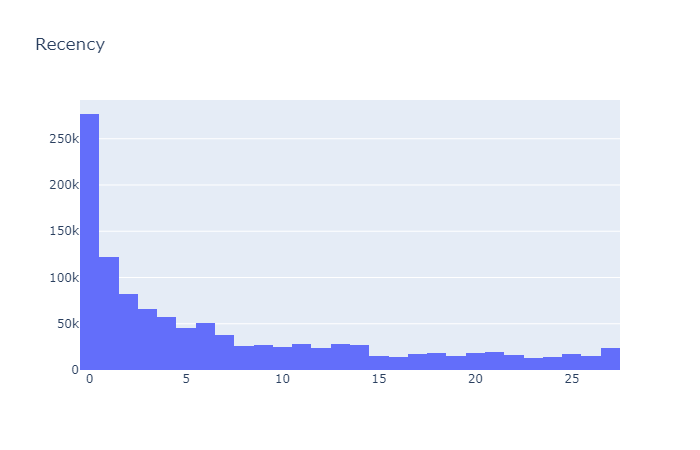
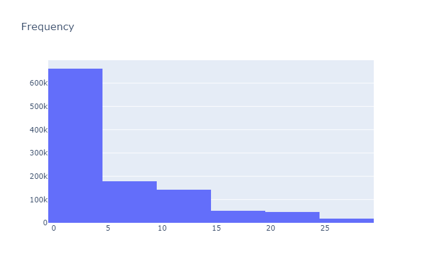
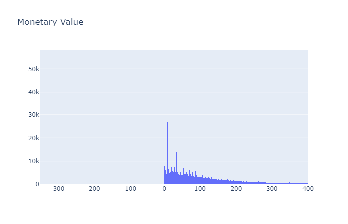
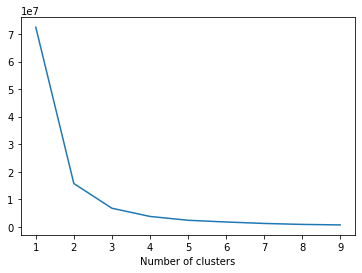
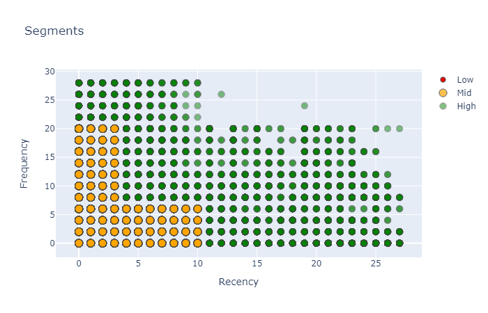
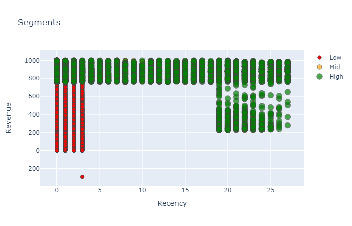
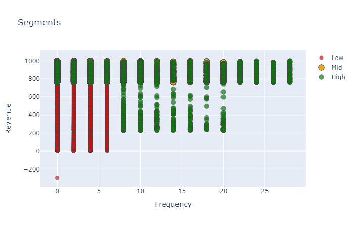

# Customer_Segmentation: Projec Overview
---

- Create a tool that runs monthly to categorize each customer_id(msisdn)
- The measures used to categorize these customers are: Revenue, Recency & Frequency aka RFM
- The aim is to have 3 categories: High Value Customers, Low Value Customers, Mid Value Customers
- Present to marketing team to target specific customers for specific campaigns

# Code and Resources Used
---

Python Version: 3.7
Packages: pandas, numpy, sklearn, KMeans, matplotlib, seaborn

# Data
---
 -   MSISDN              object        
 -   LAST_RECHARGE_DATE  datetime64[ns]
 -   BTS_MU_CITY         object        
 -   BTS_MU_LAT          object        
 -   BTS_MU_LON          object        
 -   COUNTRY             object        
 -   TARIFF_TYPE         object        
 -   ASPU                float64       
 -   RCH_COUNT_VOUCHER   float64       
 -   REGION_CLUSTER      object        
 -  TERRITORY           object
 
 # EDA
 ---
 - Recency = Last day of month - max date of recharge per msisdn
 
 
 
 - Frequency = Count of number of recharges in given month per msisdn
 
 
 
 - Revenue = Sum ASPU per msisdn 

# Model Development
---

unsupervised count optimal number of clusters:

-  Allocate cluster group to all customers for each RFM
-  Create new feature 'Overall Score' - sum eaach customer's score across Revenue, Frequency and Recency cluster

-  Group each overall score into value bracket(High Value Customers, Low Value Customers, Mid Value Customers)
-  show graphical characteristics of each value group

**Frequency_Recency_Scatter**

**Revenue_Recency_Scatter**

**Revenue_Frequency_Scatter**

